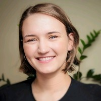

# Meet Your Faculty

#### Guillaume Bourque

>Professor, McGill University  
Director of Bioinformatics, Genome Quebec Innovation Centre  
Director, Canadian Centre of Computational Genomics  
Director, McGill initiative for Computational Medicine  
>

Dr. Bourque research interests are in comparative and functional
genomics with a special emphasis on applications of next-generation sequencing technologies.
His lab develops advanced tools and scalable computational infrastructure to enable large-scale
applied research projects.

#### Martin Hirst

>Distinguished Scientist, BC Cancer  
Professor, Department of Microbiology & Immunology  
Director, Michael Smith Laboratories  
Michael Smith Laboratories
>

Dr. Hirst’s research focuses on understanding epigenetic dysfunction in
cancer and his laboratory develops experimental and computational tools to characterize normal
and transformed cell types down to the single cell level. He applies these tools to explore the
epigenomic states of normal and transformed cell types to discover and exploit therapeutic
vulnerabilities.

#### David Bujold

>Bioinformatics Manager, Data Unit  
Canadian Centre of Computational Genomics
>

He joined the McGill Epigenomic Data Coordination Center at McGill in
2012 to tackle challenges related to epigenomics, and has since developed
many data management and discovery solutions, including the IHEC Data Portal. Other projects
of interest include CanDIG and EpiShare, platforms to make genomic and epigenomic data
under controlled access more accessible, while maintaining study participants’ privacy.

#### Jose Hector Galvez

>Bioinformatics Manager, Tech Dev Unit  
Canadian Centre of Computational Genomics
>

As a Bioinformatics Specialist in the Research and Development team,
Jose Hector is involved in maintaining, documenting, and upgrading
the RNA-seq pipelines in GenPipes. He also collaborates in several research projects, mostly
focusing on transcriptomics, genome assembly, and epigenomics.

#### Edmund Su

>Bioinformatician  
Ontario Institute for Cancer Research
>

Edmund is a bioinformatician within the genome informatics team at OICR,
where he provides technical knowledge and expertise in genomic analysis.
His main focus is developing pipelines and data wrangling for ICGC-ARGO
(International Cancer Genome Consortium - Accelerating Research in Genomic Oncology).

#### Mareike Janiak

>Bioinformatics Analyst, Tech Dev Unit  
Canadian Centre of Computational Genomics
>

As a Bioinformatics Analyst in the TechDev team, Mareike is responsible
for maintaining pipelines in GenPipes, testing and developing new pipelines
for the community, and responding to user requests. Prior to joining C3G,
she worked as both a field and computational biologist, with her doctoral and postdoctoral
research focusing on mammalian comparative genomics, phylogenomics, and metagenomics,
most often in primates.

#### Michelle Brazas

>Acting Scientific Director  
Canadian Bioinformatics Workshops (CBW)  
Toronto, ON, CA
>
> --- support@bioinformatics.ca

Dr. Michelle Brazas is the Associate Director for Adaptive Oncology at the
Ontario Institute for Cancer Research (OICR), and acting Scientific Director at Bioinformatics.ca.
Previously, Dr. Brazas was the Program Manager for Bioinformatics.ca and a faculty member in
Biotechnology at BCIT. Michelle co-founded and runs the Toronto Bioinformatics User Group
(TorBUG) now in its 11th season, and plays an active role in the International Society of
Computational Biology where she sits on the Board of Directors and Executive Board.

#### Nia Hughes

>Program Manager, Bioinformatics.ca  
Ontario Institute for Cancer Research  
Toronto, ON, Canada
>
> --- nia.hughes@oicr.on.ca

Nia is the Program Manager for Bioinformatics.ca, where she coordinates the Canadian
Bioinformatics Workshop Series. Prior to starting at OICR, she completed her M.Sc. in
Bioinformatics from the University of Guelph in 2020 before working there as a bioinformatician
studying epigenetic and transcriptomic patterns across maize varieties.

#### Zhibin Lu

>HPC and Bioinformatics Services Manager at Princess Margaret  
Cancer Centre, University Health Network  
Bioinformatics and HPC Core, UHN  
MaRS Centre, PMCRT 11-707  
101 College St  
Toronto ON M5G 1L7
>
> --- zhibin@gmail.com  
[https://bhpc.uhnresearch.ca/](https://bhpc.uhnresearch.ca/)

Zhibin Lu is a senior manager at University Health Network Digital. He is responsible for UHN
HPC operations and scientific software. He manages two HPC clusters at UHN, including
system administration, user management, and maintenance of bioinformatics tools for
HPC4health. He is also skilled in Next-Gen sequence data analysis and has developed and

maintained bioinformatics pipelines at the Bioinformatics and HPC Core. He is a member of the
Digital Research Alliance of Canada Bioinformatics National Team and Scheduling National
Team.

