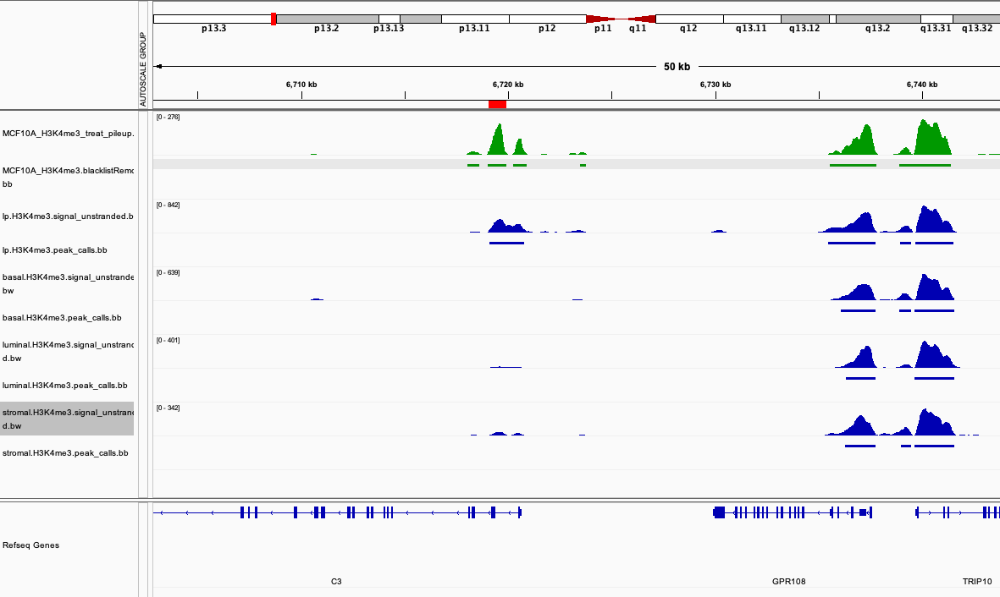
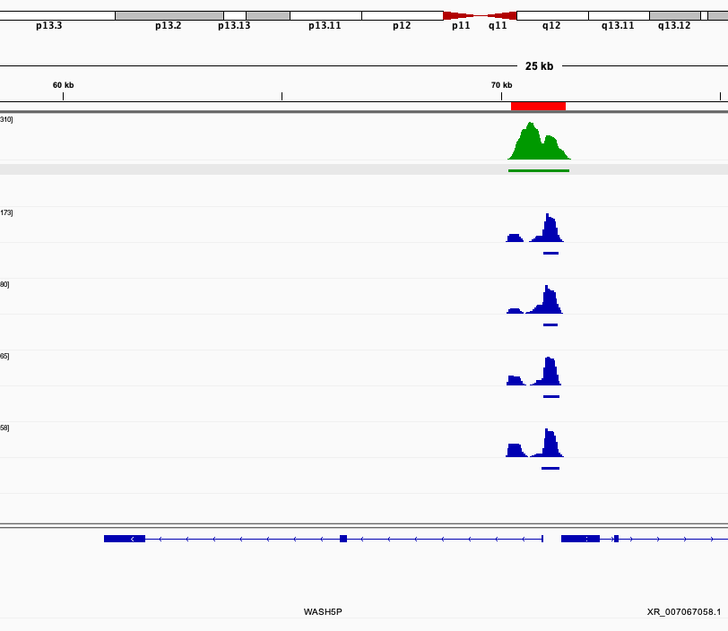
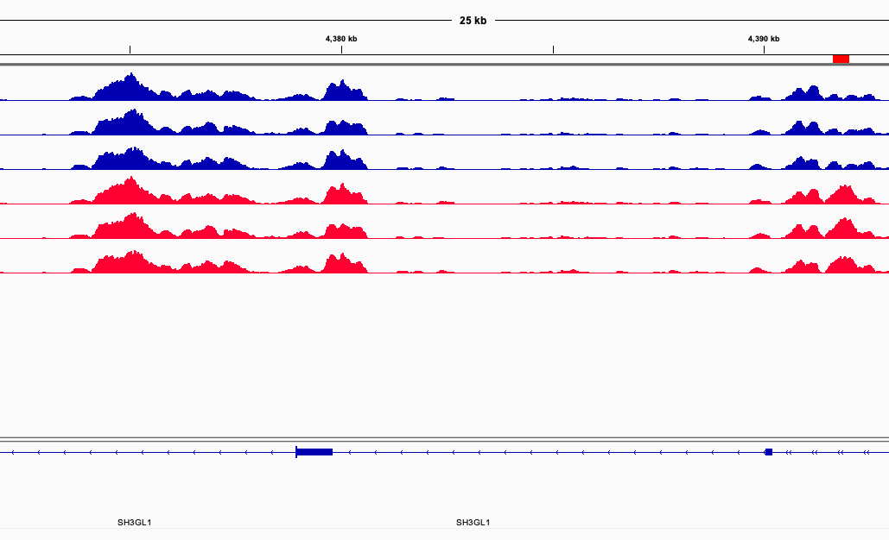

# Module 3: ChIP-seq Differential Analysis

## Lecture

<iframe width="640" height="360" src="https://www.youtube.com/embed/Ja3TbSw2Lao?si=pyK5vOwJsdNiauhP" title="YouTube video player" frameborder="0" allow="accelerometer; autoplay; clipboard-write; encrypted-media; gyroscope; picture-in-picture; web-share" referrerpolicy="strict-origin-when-cross-origin" allowfullscreen></iframe>

<br>

<iframe src="https://drive.google.com/file/d/1LPc4t8mdc1RypIWCaWqJKhjju_4xkGQ0/preview" width="640" height="480" allow="autoplay"></iframe>

## Lab

### Breakdown of markdown file
- At the start of each step, the intention will declare.
- this is then follow by a code block

**Code:**
```
Like this! This is the main code to run for the step.

Additionally the code block will include a header to indicate what environment to the run code for example:
###Shell###
pwd

###R###
getwd()
```

- explaining for commands will be broken down following code block
- `pwd` & `getwd()`
    - see your work directory
- sprinkled throughout will also include comments

:::: {.callout type="blue" title="Note"}

Important points and considerations will also be raised as so.

::::

### Module 3 - Differential Analysis
#### Step1A: Copy bigWig resources
- we'll load some bigWigs to compare with

**Code**
```
###Shell###
cp ~/CourseData/EPI_data/module123/encode_bigWig/*H3K4me3* ~/workspace/module123/bigWig/
cp ~/CourseData/EPI_data/module123/encode_bigBed/*H3K4me3* ~/workspace/module123/bigBed/
cp ~/CourseData/EPI_data/module123/triplicates/bigWig/* ~/workspace/module123/bigWig/
```


#### Step1B: Using Bedtools to compare marks
- We'll explore how to use bedtools to compare MCF10A histone marks and the interpretation of results

**Code**
```
###Shell###
MCF10A_H3K27ac=~/workspace/module123/peaks/MCF10A_H3K27ac_peaks.blacklistRemoved.narrowPeak
MCF10A_H3K27me3=~/workspace/module123/peaks/MCF10A_H3K27me3_peaks.blacklistRemoved.broadPeak
MCF10A_H3K4me3=~/workspace/module123/peaks/MCF10A_H3K4me3_peaks.blacklistRemoved.narrowPeak

bedtools intersect -u -a ${MCF10A_H3K27ac} -b ${MCF10A_H3K27me3} | wc -l
bedtools intersect -u -a ${MCF10A_H3K27ac} -b ${MCF10A_H3K4me3} | wc -l
```
- `bedtools intersect -u -a ${MCF10A_H3K27ac} -b ${MCF10A_H3K27me3} | wc -l`
  - results in an intersect of `6/988`
- `bedtools intersect -u -a ${MCF10A_H3K27ac} -b ${MCF10A_H3K4me3} | wc -l`
  - results in an intersect of `789/988`
- what do we know about the relationship of H3K27ac vs H3K27me3 vs H3K4me3?
  - H3K27ac and H3K27me3 tend to be antagonistic, hence the very small intersect
  - H3K27ac co-occurs with H3K4me3 at promoters, hence the larger intersect

#### Step1C: Using Bedtools to compare samples
- We'll demonstrate how to do comparisons on mass against ENCODE breast data and interpret results

**Code**
```
###Shell###
basal_H3K27ac=~/CourseData/EPI_data/module123/encode_bed/basal.H3K27ac.peak_calls.bed
luminal_H3K27ac=~/CourseData/EPI_data/module123/encode_bed/luminal.H3K27ac.peak_calls.bed
stromal_H3K27ac=~/CourseData/EPI_data/module123/encode_bed/stromal.H3K27ac.peak_calls.bed
lp_H3K27ac=~/CourseData/EPI_data/module123/encode_bed/lp.H3K27ac.peak_calls.bed
MCF10A_H3K27ac=~/workspace/module123/peaks/MCF10A_H3K27ac_peaks.blacklistRemoved.narrowPeak

paste \
<(ls ~/CourseData/EPI_data/module123/encode_bed/*H3K4me3* | xargs -I {} sh -c "bedtools intersect -u -a ~/workspace/module123/peaks/MCF10A_H3K4me3_peaks.blacklistRemoved.narrowPeak -b {} | wc -l") \
<(ls ~/CourseData/EPI_data/module123/encode_bed/*H3K27ac* |  xargs -I {} sh -c "bedtools intersect -u -a ~/workspace/module123/peaks/MCF10A_H3K27ac_peaks.blacklistRemoved.narrowPeak -b {} | wc -l") \
<(ls ~/CourseData/EPI_data/module123/encode_bed/*H3K27me3* |  xargs -I {} sh -c "bedtools intersect -u -a ~/workspace/module123/peaks/MCF10A_H3K27me3_peaks.blacklistRemoved.broadPeak -b {} | wc -l")
```
- `paste \
<(ls CourseData/module123/bed/*H3K4me3* | xargs -I {} sh -c "bedtools intersect -u -a workspace/module123/peaks/MCF10A_H3K4me3_peaks.blacklistRemoved.narrowPeak -b {} | wc -l") \
<(ls CourseData/module123/bed/*H3K27ac* |  xargs -I {} sh -c "bedtools intersect -u -a workspace/module123/peaks/MCF10A_H3K27ac_peaks.blacklistRemoved.narrowPeak -b {} | wc -l")`
  - `paste` lets us aggregate our results where each column is the output from the command within `<(COMMAND)`
  - Each `<(COMMAND)`, contains the following `LOOKUP | FORLOOP intersect and count`
  - `\` let's continue our command on another line
- Intersect numbers:

| |H3K4me3|H3K27ac|H3K27me3|
|------------- | ------------- | ------------- | ------------- |
|MCF10A|1406|988|4797|
|Intersecting Basal|1039|656|2420|
|Intersecting Luminal Progenitor|1099|778|2496|
|Intersecting Luminal|1024|766|2430|
|Intersecting Stromal|978|717|2604|


- MCF10A is luminal progenitor like, how is that relationship reflect in the epigenetic landscape?
  - higher amount of intersect in permissive marks of H3K4me3 and H3K27ac

#### Step1D: Using Bedtools and pipe
- We'll demonstrate advanced queries by piping and doing multiple bedtool queries

**Code:**
```
###Shell###
basal_H3K4me3=~/CourseData/EPI_data/module123/encode_bed/basal.H3K4me3.peak_calls.bed
luminal_H3K4me3=~/CourseData/EPI_data/module123/encode_bed/luminal.H3K4me3.peak_calls.bed
stromal_H3K4me3=~/CourseData/EPI_data/module123/encode_bed/stromal.H3K4me3.peak_calls.bed
lp_H3K4me3=~/CourseData/EPI_data/module123/encode_bed/lp.H3K4me3.peak_calls.bed
MCF10A_H3K4me3=~/workspace/module123/peaks/MCF10A_H3K4me3_peaks.blacklistRemoved.narrowPeak

bedtools intersect -u -a ${MCF10A_H3K4me3} -b ${lp_H3K4me3} | bedtools intersect -v -a stdin -b ${basal_H3K4me3} ${luminal_H3K4me3} ${stromal_H3K4me3} | wc -l

bedtools intersect -u -a ${MCF10A_H3K4me3} -b ${lp_H3K4me3} |\
bedtools intersect -u -a stdin -b ${basal_H3K4me3} |\
bedtools intersect -u -a stdin -b ${luminal_H3K4me3} |\
bedtools intersect -u -a stdin -b ${stromal_H3K4me3} | wc -l
```
- `bedtools intersect -u -a ${MCF10A_H3K4me3} -b ${lp_H3K4me3} | bedtools intersect -v -a stdin -b ${basal_H3K4me3} ${luminal_H3K4me3} ${stromal_H3K4me3}| wc -l`
  -  The command can be broken down into the following : `Common with LP | Not found in Basal OR Luminal OR stromal`
  - `stdin` takes the results from half of our command and utilizies as input in the next
  - Other tools may have a similar function of `stdin`. Check documentation first.



- `bedtools intersect -u -a ${MCF10A_H3K4me3} -b ${lp_H3K4me3} |  bedtools intersect -u -a stdin -b  {basal_H3K4me3} | bedtools intersect -u -a stdin -b ${luminal_H3K4me3} | bedtools intersect -u -a stdin -b ${stromal_H3K4me3}  | wc -l`
  - The command can be broken down into the following : `MCF10A Common with LP | Common with Basal | Common with Luminal | Stromal`
  


#### Step1E: Using Bedtools to compare binary conditions/models
- We'll explore how to use bedtools to compare binary conditions and possible interpretations

**Code:**
```
###Shell###
condA_rep1=~/CourseData/EPI_data/module123/triplicates/peaks/CondA.Rep1_peaks.narrowPeak  
condB_rep1=~/CourseData/EPI_data/module123/triplicates/peaks/CondB.Rep1_peaks.narrowPeak
condA_rep2=~/CourseData/EPI_data/module123/triplicates/peaks/CondA.Rep2_peaks.narrowPeak  
condB_rep2=~/CourseData/EPI_data/module123/triplicates/peaks/CondB.Rep2_peaks.narrowPeak
condA_rep3=~/CourseData/EPI_data/module123/triplicates/peaks/CondA.Rep3_peaks.narrowPeak
condB_rep3=~/CourseData/EPI_data/module123/triplicates/peaks/CondB.Rep3_peaks.narrowPeak

bedtools intersect -u -a ${condA_rep1} -b ${condA_rep2} | wc -l
bedtools intersect -u -a ${condA_rep1} -b ${condB_rep2} | wc -l 
bedtools intersect -v -a ${condA_rep1} -b ${condA_rep2} | wc -l
bedtools intersect -v -a ${condA_rep1} -b ${condB_rep2} | wc -l

bedtools intersect -u -a ${condA_rep1} -b ${condA_rep2} ${condA_rep3} | wc -l

bedtools intersect -u -a ${condA_rep1} -b ${condA_rep2} ${condA_rep3} -f 0.5 -F 0.5 | wc -l

bedtools intersect -wao -a ${condA_rep1} -b ${condA_rep2} ${condA_rep3} | head
```

- `bedtools intersect -u -a ${condA_rep1} -b ${condA_rep2} | wc -l `
    - counting the number of condA_rep1 peaks that intersect condA_rep2
    - returns `1191`
- `bedtools intersect -u -a ${condA_rep1} -b ${condB_rep2} | wc -l `
    - counting the number of condA_rep1 peaks that intersect condB_rep2
    - returns `1093`
- `bedtools intersect -v -a ${condA_rep1} -b ${condA_rep2} | wc -l`
    - counting the number of condA_rep1 peaks that do not intersect condA_rep2
    - return `50`
- `bedtools intersect -v -a ${condA_rep1} -b ${condB_rep2} | wc -l`
    - counting the number of condA_rep1 peaks that do not intersect condB_rep2
    - returns `148`
- as expected our replicates of matching conditions have more in common
- `bedtools intersect -u -a ${condA_rep1} -b ${condA_rep2} ${condA_rep3} | wc -l`
   - counting the number of condA_rep1 peaks that intersect condA_rep2 or condA_rep3
- `bedtools intersect -wao -a ${condA_rep1} -b ${condA_rep2} ${condA_rep3} | head`
   - specify `-wao` returns the original line of `${condA_rep1}` and the element it intersects
   - additionally adds an identify column for the database and number of base pairs overlapping
- `bedtools intersect -u -a ${condA_rep1} -b ${condA_rep2} ${condA_rep3} -f 0.5 -F 0.5 | wc -l`
   - the flag `-f 0.5` adds the conditions that inte##rsects are only counted when 50% overlap of A occurs
   - the flag `-F 0.5` adds the conditions that intersects are only counted when 50% overlap of B occurs
   - if we remove one of the flags, how does the number change?
   - what if we wanted integer threshold instead of percentage?
- `bedtools intersect -wao -a ${condA_rep1} -b ${condA_rep2} ${condA_rep3} | head`
   - specify `-wao` returns the original line of `${condA_rep1}` and the element it intersects
   - additionally adds an identify column for the database and number of base pairs overlapping


#### Step1F: Other useful bedtool functions
- We'll highlight other useful bedtool applications.

**Code:**
```
###Shell###
MCF10A_H3K27ac=~/workspace/module123/peaks/MCF10A_H3K27ac_peaks.blacklistRemoved.narrowPeak
TSS=~/workspace/module123/resources/hg38v79_genes_tss_2000.bed

bedtools closest -a ${MCF10A_H3K27ac} -b ${TSS} -d | head

###
condA_peaks=~/CourseData/EPI_data/module123/triplicates/peaks/CondA.Rep1_peaks.narrowPeak
condB_peaks=~/CourseData/EPI_data/module123/triplicates/peaks/CondB.Rep1_peaks.narrowPeak

cat ${condA_peaks} ${condB_peaks} | sort -k1,1 -k2,2n | bedtools merge -i stdin > ~/workspace/module123/deeptools/merged_peaks.bed

####
methylation=~/workspace/module123/resources/example_methylation.bed

echo chr19 1 58617616 |\
sed 's/ /\t/g' |\
bedtools makewindows -w 50 -b stdin |\
awk 'BEGIN{{srand(1)}}{print $0"\t"rand()}' \
> ${methylation}

bedtools map -a ${MCF10A_H3K27ac} -b ${methylation} -c 4 -o median,count | head
```
- `sed 's/ /\t/g'` replace a ` ` with `\t` 
- `bedtools closest -a ${MCF10A_H3K27ac} -b ${TSS} -d | head`
    - Identifies features in fileB that are closes to fileA
    - useful for mapping enhancers to their closest transcription start site
    - `-d` will make the tool report the distance
    - in our example, if the distance is zero the H3K27ac instead reflects an activated promoter.
- `cat ${condA_rep1} ${condA_rep2} ${condA_rep3} | sort -k1,1 -k2,2n | bedtools merge -i stdin | wc -l`
    - Pseudo code : `read peak files | sort peak files | merge peak files | line count`
    - `bedtools merge` takes elements specified in the input and merges the features if they intersect
    - behaviour can be modified to require a certain mount overlap or bookended features
    - compare how many peaks `cat ${condA_rep1} ${condA_rep2} ${condA_rep3}` starts off with
    - following merge how many peaks are left?
- `echo chr19\\t1\\t58617616 | bedtools makewindows -w 50 -b stdin | awk 'BEGIN{srand(1);}{print $0"\t"rand()}'  > ${metylation}`
    - Pseudo code : `simulate a bed file of chr19 | turn bedFile into 50bp bins | add random float value `
    - `echo chr19\\t1\\t58617616`
        - '`\\t` an escape character is uses to generate a tab
    - `bedtools makewindows -w 50 -b stdin`
        - `-w 50` specifies our window size
        - can alternatively use `-n` to specified how many windows we want to divide our bedFile into
    - `awk 'BEGIN{srand(1);}{print $0"\t"rand()}'`
        - read our input (the 50bp window bed file of chr19) and generate a random float
        - `srand(1)` set our seed number. Changing this will affect our pseudo random numbers
        - `print $0"\t"rand()` as `awk` process line by line, print the current line (the windowed genomic coordiantes) and a random float number
    - `bedtools map -a ${MCF10A_H3K27ac} -b ${methylation} -c 4 -o median,count`
        - `bedtools map` apply a function summarizing the values of fileB that intersect fileA
        - in our example for we're looking at the methylation of H3K27ac peaks
        - `-c 4` indicates which columns from fileB we'd like to use
        - `-o median,count` return the median of col 4 and coutn the number of elements from fileB that intersected the particular element from fileA

#### Step2: Differential peaks utilizing triplicates and DiffBind
- We'll perform analysis on mock MFC10A H3K4me3 data to get significant differential peaks for each condition. To do so, we'll utilizing the `diffBind` package in R

**Code :**
```
###R###
library(DiffBind)
setwd("/home/ubuntu")
samples <- read.csv("CourseData/EPI_data/module123/triplicates/triplicates.csv")
MCF10A <- dba(sampleSheet=samples)
MCF10A <- dba.count(MCF10A, bUseSummarizeOverlaps=TRUE)
dba.plotPCA(MCF10A, attributes=DBA_CONDITION,label=DBA_ID)
plot(MCF10A)
MCF10A <- dba.contrast(MCF10A, categories=DBA_CONDITION)

MCF10A <- dba.analyze(MCF10A, method=DBA_EDGER)

analyzed_peaks <- dba.report(MCF10A, method=DBA_EDGER, fold=1)

dba.plotMA(MCF10A, bXY=TRUE , method=DBA_EDGER, fold=1)

write.table(analyzed_peaks, file="workspace/module123/diffBind/differential_peaks.tsv", sep="\t", quote=F, row.names=F, col.names=F)
```
- `library(DiffBind)`
    - we load R package [DiffBind](https://bioconductor.org/packages/release/bioc/html/DiffBind.html)
- `setwd("/home/ubuntu")`
    - set our working directory
- `read.csv("CourseData/EPI_data/module123/triplicates/triplicates.csv")`
    - read in our csv
    - let's inspect the columns
- `MCF10A <- dba(sampleSheet=samples)`
    - read our samplesheet into the `dba` object that will be saved as `MCF10A`
- `MCF10A <- dba.count(MCF10A, bUseSummarizeOverlaps=TRUE)`
    - count the number of fragments that intersect with peaks
    - `bUseSummarizeOverlaps=TRUE` indicates the counting module to be used. `SummarizeOverlaps` comes from [GenomicAlignments](https://www.rdocumentation.org/packages/GenomicAlignments/versions/1.8.4/topics/summarizeOverlaps-methods).
- `dba.plotPCA(MCF10A, attributes=DBA_CONDITION,label=DBA_ID)`
    - generate a principle component analysis using data from our object `MCF10A` where the annotations are `DBA_CONDITION` and the labelling is `DBA_ID`
- `plot(MCF10A)`
    - generate a heatmap with correlation and dendrogram
    - should note the correlation is based on score of overlap and not pearson and spearman, should recalculate
- `MCF10A <- dba.contrast(MCF10A, categories=DBA_CONDITION)`
   - declares what are the conditions for our differential groups
   - `categories=DBA_CONDITION` the category we want to compare
- `MCF10A <- dba.analyze(MCF10A, method=DBA_EDGER)`
   - perform an analysis based on the `contrast` we previously established.
   - `method=DBA_EDGER`, analysis engine is a library called `edgeR`
   - note for our specific example `deseq2` does not work. `Deseq2` has a built in check for variablity which our synthetic dataset is lacking

- `analyzed_peaks <- dba.report(MCF10A, method=DBA_EDGER, fold=1)`
    - report the peaks identified by `DBA_EDGER` to be significant and have an absolute fold change `>1`
- `dba.plotMA(MCF10A, bXY=TRUE , method=DBA_EDGER, fold=1)`
    - generates Scatter plot
    - `method=DBA_EDGER` fetch results based on our previous analysis using `edgeR`
    - `bXY=TRUE` produces a scatter plot, `FALSE` produces a MA plot
    - `fold=1` report differential positions that meet fold change threshold

- `write.table(analyzed_peaks, file="workspace/module123/diffBind/differential_peaks.tsv", sep="\t", quote=F, row.names=F, col.names=T)`
   - save our differential peaks to a TSV
   - `sep="\t"` the seperator to be used
   - `col.names=T` include column names
   - `row.names=F` include row names
   - `quote=F` if we want to include quotations around values
 


#### Step3A: Differential peaks utilizing Fold change and significance - Merged peaks
- Previously we performed differential analysis on triplicates, now let's explore how to do so on two samples.
- We'll combine our two peak sets into an unified set.

**Code:**
```
###Shell###
condA_peaks=~/CourseData/EPI_data/module123/triplicates/peaks/CondA.Rep1_peaks.narrowPeak
condB_peaks=~/CourseData/EPI_data/module123/triplicates/peaks/CondB.Rep1_peaks.narrowPeak

cat ${condA_peaks} ${condB_peaks} | sort -k1,1 -k2,2n | bedtools merge -i stdin > ~/workspace/module123/edgeR/merged_peaks.bed
```
- `cat ${condA_peaks} ${condB_peaks} | sort -k1,1 -k2,2n | bedtools merge -i stdin > merged_peaks.bed`
    - Pseudo code break down : `Read our peaks | sort peaks coordinate wise | merge peaks`

#### Step3B: Differential peaks utilizing Fold change and significance - Merged peaks
- We'll combine our two peak sets into an unified set.

**Code:**
```
###Shell###
condA_peaks=~/CourseData/EPI_data/module123/triplicates/peaks/CondA.Rep1_peaks.narrowPeak
condB_peaks=~/CourseData/EPI_data/module123/triplicates/peaks/CondB.Rep1_peaks.narrowPeak
mkdir ~/workspace/module123/edgeR/
cat ${condA_peaks} ${condB_peaks} | sort -k1,1 -k2,2n | bedtools merge -i stdin > ~/workspace/module123/edgeR/merged_peaks.bed
```
- `cat ${condA_peaks} ${condB_peaks} | sort -k1,1 -k2,2n | bedtools merge -i stdin > merged_peaks.bed`
    - Pseudo code break down : `Read our peaks | sort peaks coordinate wise | merge peaks`

#### Step3B: Differential peaks utilizing Fold change and significance - read counts per peak
- We'll derrive RPKM values per BAM for each peak in our peak set

**Code:**
```
###Shell###
peaks=~/workspace/module123/edgeR/merged_peaks.bed
condA_bam=~/workspace/module123/alignments/MCF10A_H3K4me3_chr19.CondA.Rep1.bam
condB_bam=~/workspace/module123/alignments/MCF10A_H3K4me3_chr19.CondB.Rep1.bam

condA_count=~/workspace/module123/edgeR/MCF10A_H3K4me3_chr19.CondA.Rep1.bed
condB_count=~/workspace/module123/edgeR/MCF10A_H3K4me3_chr19.CondB.Rep1.bed

bedtools intersect -a ${peaks} -b ${condA_bam} -c > ${condA_count}
bedtools intersect -a ${peaks} -b ${condB_bam} -c > ${condB_count}
```
- `bedtools intersect -a ${peaks} -b ${condA_bam} -c > ${condA_count}`
    - our intersect command is the same in principle but we're intersecting our peaks with a `BAM` file
    - `-c` reports counts of our `BAM` that overlap our peaks 


#### Step3C: Differential peaks utilizing Fold change and significance - EdgeR differential
- we'll read our data into `R` and perform a statistical analysis

**Code:**
```
```
###R###
setwd("/home/ubuntu")
library(edgeR)
library(dplyr)

condA<-read.csv("workspace/module123/edgeR/MCF10A_H3K4me3_chr19.CondA.Rep1.bed",sep='\t',col.names = c("chr", "start", "end","MCF10A_H3K4me3_chr19.CondA.Rep1"),colClasses= c("character","character","character","numeric"))
condB<-read.csv("workspace/module123/edgeR/MCF10A_H3K4me3_chr19.CondB.Rep1.bed",sep='\t',col.names = c("chr", "start", "end","MCF10A_H3K4me3_chr19.CondB.Rep1"),colClasses= c("character","character","character","numeric"))

peaks<-data.frame(
    MCF10A_H3K4me3_chr19.CondA.Rep1=condA$MCF10A_H3K4me3_chr19.CondA.Rep1,
    MCF10A_H3K4me3_chr19.CondB.Rep1=condB$MCF10A_H3K4me3_chr19.CondB.Rep1
    )
row.names(peaks)<-paste(condA$chr,condA$start,condA$end,sep='_')

edger_dl <- DGEList(counts=peaks, group=1:2,lib.size=c(1131503,1266436))

edger_tmm <- calcNormFactors(edger_dl, method = "TMM")

bvc=0.1

edger_et <- exactTest(edger_tmm,dispersion=bvc^2)

edger_tp <- topTags(edger_et, n=nrow(edger_et$table),adjust.method="BH")


de <- edger_tp$table %>% filter(FDR < 0.01) %>% filter(logFC >=1 | logFC <=-1)

write.table(de, file="workspace/module123/edgeR/differential_peaks_edger.tsv", sep="\t", quote=F, row.names=F, col.names=F)
```
- `condA<-read.csv("workspace/module123/edgeR/MCF10A_H3K4me3_chr19.CondA.Rep1.bed",sep='\t',col.names = c("chr", "start", "end","MCF10A_H3K4me3_chr19.CondA.Rep1"),colClasses= c("character","character","character","numeric"))`
    - `read.csv` read the `CSV` file into a `data.frame`
    - `sep='\t'` specify the delimiter
    - `col.names = c("chr", "start", "end","MCF10A_H3K4me3_chr19.CondA.Rep1")` set our column names
    - `colClasses= c("character","character","character","numeric")` indicate with column are what datatypes
- `peaks<-data.frame(MCF10A_H3K4me3_chr19.CondA.Rep1=condA$MCF10A_H3K4me3_chr19.CondA.Rep1,MCF10A_H3K4me3_chr19.CondB.Rep1=condB$MCF10A_H3K4me3_chr19.CondB.Rep1)`
    - make a new data.frame using our two columns from condA and condB
- `row.names(peaks)<-paste(peaks$chr,peaks$start,peaks$end,sep='_')`
    - edit row names to be match genomic coordinates
    - ``row.names(peaks)<-` indicate we want to overwrite exist row names
    - `paste(peaks$chr,peaks$start,peaks$end,sep='_')` we want to concatenate our `chr`,`start` and `end` with `_` as a seperator
- `edger_dl <- DGEList(counts=peaks, group=1:2,lib.size=c(1131503,1266436))`
    - `DGEList(counts=peaks_clean, group=1:2)` read in our `peak_clean` data.frame
    - `group=1:2` identify which groups we want to contrast
    - `lib.size=c(1131503,1266436)` library size for the two conditions
- `edger_tmm <- calcNormFactors(edger_dl, method = "TMM")` calculate the normalization factor to scale library sizes
- `bvc=0.01` Set the `square-rootdispersion`. according to edgeR documentation: `from well-controlled experiments are 0.4 for human data, 0.1 for data on genetically identical model organisms or 0.01 for technical replicates`
- `edger_et <- exactTest(edger_dl,dispersion=bcv^2)`
    - calculate `FC` and `Pvalue` per row
- `edger_tp <- topTags(edger_et, n=nrow(edger_et$table),adjust.method="BH")`
    - calcualte `FDR` via Benjamini-Hochberg
- `de <- edger_tp$table %>% filter(FDR < 0.01) %>% filter(logFC >=1 | logFC <=-1)`
    - `filter(FDR < 0.01)` filter for significant peaks
    - `filter(logFC >=1 | logFC <=-1)` filter for peaks with appropriate fold change
- `write.table(de, file="workspace/module123/edgeR/differential_peaks_edger.tsv", sep="\t", quote=F, row.names=F, col.names=F)`
    - save files

```

### Server resources
#### QC Resources
```
###TSS+/-2kb
mkdir workspace/module123/qc
wget https://www.bcgsc.ca/downloads/esu/touchdown/hg38v79_genes_tss_2000.bed -O workspace/module123/resources/hg38v79_genes_tss_2000.bed

sort -k1,1 -k2,2n workspace/module123/resources/hg38v79_genes_tss_2000.bed > tmp
mv tmp workspace/module123/resources/hg38v79_genes_tss_2000.bed

###Enhancer liftover
wget https://www.bcgsc.ca/downloads/esu/touchdown/encode_enhancers_liftover.bed -O workspace/module123/resources/encode_enhancers_liftover.bed

###Blacklist
wget https://www.encodeproject.org/files/ENCFF356LFX/@@download/ENCFF356LFX.bed.gz -O ~/workspace/module123/resources/hg38_blacklist.bed.gz

gunzip ~/workspace/module123/resources/hg38_blacklist.bed.gz
```
- `hg38v79_genes_tss_2000.bed`
    - Generated by downloading Ensemblv79 GTF convert to Bed +/-2kb of TSS. See https://www.biostars.org/p/56280/
- `encode_enhancers_liftover.bed`
    - download various [ChroHMM state7](https://egg2.wustl.edu/roadmap/data/byFileType/chromhmmSegmentations/ChmmModels/coreMarks/jointModel/final/) and merge


#### Encode Bed
```
ls ~/CourseData/EPI_data/module123/encode_bed
basal.H3K27ac.peak_calls.bed
basal.H3K27me3.peak_calls.bed
basal.H3K4me1.peak_calls.bed
basal.H3K4me3.peak_calls.bed
lp.H3K27ac.peak_calls.bed
lp.H3K27me3.peak_calls.bed
lp.H3K4me1.peak_calls.bed
lp.H3K4me3.peak_calls.bed
luminal.H3K27ac.peak_calls.bed
luminal.H3K27me3.peak_calls.bed
luminal.H3K4me1.peak_calls.bed
luminal.H3K4me3.peak_calls.bed
stromal.H3K27ac.peak_calls.bed
stromal.H3K27me3.peak_calls.bed
stromal.H3K4me1.peak_calls.bed
stromal.H3K4me3.peak_calls.bed
```
- https://epigenomesportal.ca/tracks/CEEHRC/hg38/
- Breast Basal CEMT0035
- Breast Stromal CEMT0036
- Breast Luminal CEMT0037
- Breast Luminal Progenitor CEMT0038
#### Encode BigWig
```
ls ~/CourseData/EPI_data/module123/encode_bigWig
basal.H3K27ac.signal_unstranded.bigWig
basal.H3K27me3.signal_unstranded.bigWig
basal.H3K4me1.signal_unstranded.bigWig
basal.H3K4me3.signal_unstranded.bigWig
lp.H3K27ac.signal_unstranded.bigWig
lp.H3K27me3.signal_unstranded.bigWig
lp.H3K4me1.signal_unstranded.bigWig
lp.H3K4me3.signal_unstranded.bigWig
luminal.H3K27ac.signal_unstranded.bigWig
luminal.H3K27me3.signal_unstranded.bigWig
luminal.H3K4me1.signal_unstranded.bigWig
luminal.H3K4me3.signal_unstranded.bigWig
stromal.H3K27ac.signal_unstranded.bigWig
stromal.H3K27me3.signal_unstranded.bigWig
stromal.H3K4me1.signal_unstranded.bigWig
stromal.H3K4me3.signal_unstranded.bigWig
```
- https://epigenomesportal.ca/tracks/CEEHRC/hg38/
- Breast Basal CEMT0035
- Breast Stromal CEMT0036
- Breast Luminal CEMT0037
- Breast Luminal Progenitor CEMT0038
#### MCF10A Fastq
```
ls ~/CourseData/EPI_data/module123/fastq
MCF10A.ATAC.chr19.R1.fastq.gz
MCF10A.ATAC.chr19.R2.fastq.gz
MCF10A.H3K27ac.chr19.R1.fastq.gz
MCF10A.H3K27ac.chr19.R2.fastq.gz
MCF10A.H3K27me3.chr19.R1.fastq.gz
MCF10A.H3K27me3.chr19.R2.fastq.gz
MCF10A.H3K4me3.chr19.R1.fastq.gz
MCF10A.H3K4me3.chr19.R2.fastq.gz
MCF10A.Input.chr19.R1.fastq.gz
MCF10A.Input.chr19.R2.fastq.gz
```
- MCF10A histone marks and input come courtesy of Dr.Hirst
- ATACseq data originates from [GSM6431322](https://www.ncbi.nlm.nih.gov/geo/query/acc.cgi?acc=GSM6431322)
#### Triplicates
```
CourseData/EPI_data/module123/triplicates/triplicates.csv

CourseData/EPI_data/module123/triplicates/alignments:
MCF10A_H3K4me3_chr19.CondA.Rep1.bam      MCF10A_H3K4me3_chr19.CondB.Rep2.bam      MCF10A_input_chr19.CondA.Rep3.bam
MCF10A_H3K4me3_chr19.CondA.Rep1.bam.bai  MCF10A_H3K4me3_chr19.CondB.Rep2.bam.bai  MCF10A_input_chr19.CondA.Rep3.bam.bai
MCF10A_H3K4me3_chr19.CondA.Rep2.bam      MCF10A_H3K4me3_chr19.CondB.Rep3.bam      MCF10A_input_chr19.CondB.Rep1.bam
MCF10A_H3K4me3_chr19.CondA.Rep2.bam.bai  MCF10A_H3K4me3_chr19.CondB.Rep3.bam.bai  MCF10A_input_chr19.CondB.Rep1.bam.bai
MCF10A_H3K4me3_chr19.CondA.Rep3.bam      MCF10A_input_chr19.CondA.Rep1.bam        MCF10A_input_chr19.CondB.Rep2.bam
MCF10A_H3K4me3_chr19.CondA.Rep3.bam.bai  MCF10A_input_chr19.CondA.Rep1.bam.bai    MCF10A_input_chr19.CondB.Rep2.bam.bai
MCF10A_H3K4me3_chr19.CondB.Rep1.bam      MCF10A_input_chr19.CondA.Rep2.bam        MCF10A_input_chr19.CondB.Rep3.bam
MCF10A_H3K4me3_chr19.CondB.Rep1.bam.bai  MCF10A_input_chr19.CondA.Rep2.bam.bai    MCF10A_input_chr19.CondB.Rep3.bam.bai

CourseData/EPI_data/module123/triplicates/bigWig:
CondA.Rep1.bw  CondA.Rep2.bw  CondA.Rep3.bw  CondB.Rep1.bw  CondB.Rep2.bw  CondB.Rep3.bw

CourseData/EPI_data/module123/triplicates/peaks:
CondA.Rep1_peaks.narrowPeak  CondA.Rep3_peaks.narrowPeak  CondB.Rep2_peaks.narrowPeak
CondA.Rep2_peaks.narrowPeak  CondB.Rep1_peaks.narrowPeak  CondB.Rep3_peaks.narrowPeak
```
- triplicates were generated from MCF10A_H3K4me3 by choosing a list of exclusive peaks for condA and condB and subsampling replicates accordingly

:::: {.callout type="green" title="Lab Completed!"}

Congratulations! You have completed Lab 3!

::::
