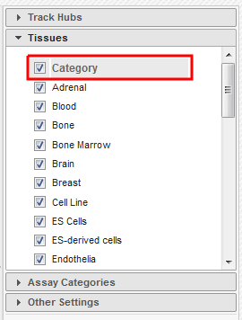
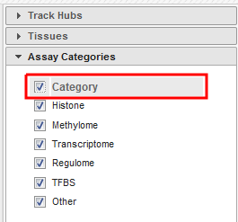
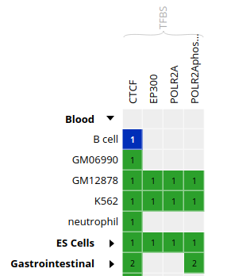

# Module 5: Downstream analyses & integrative tools
*by David Bujold, M.Sc.*

## Important notes:
* The username **user01** in all of the commands below is provided as an example. 
You should always replace it with the user that was assigned to you for this workshop. 


## Introduction

### Description of the lab
We will now explore some of the tools that were covered in the lecture for module 5.

* First, we will learn how to use the IHEC Data Portal's tools to fetch feature tracks of interest.
* Second, we will explore ChIP-Seq peak prediction files (in bed format) to discover motifs using HOMER.
* Third, we will use an IHEC dataset with the GREAT GO enrichment tool to do functions prediction.
* Last, we'll explore and launch a few jobs on the Galaxy web platform.

### Local software that we will use

**You should already have an open connection to Compute Canada, either through JupyterLab, or through an ssh terminal session.** 

* A web browser
* scp or WinSCP to transfer results from Compute Canada to your computer


## Tutorial

#####  Preparation on your Compute Canada session

From your Compute Canada terminal session, go to your home folder.

```
cd ~
```

You will be in your home folder.

##### Prepare directory for module 5

* If it exists, remove any ```module5``` directory in your home directory with the "rm" command.
* Create a new ```module5``` directory.
* Go to that directory.

```
rm -rf ~/module5
mkdir -p ~/module5
cd ~/module5
```

### 1- IHEC Data Portal

#### Exploring available datasets
* Open a web browser on your computer, and load the URL [http://epigenomesportal.ca/ihec](http://epigenomesportal.ca/ihec) .

* In the Overview page, click on the "View all" button.

* You will get a grid with all available datasets for IHEC Core Assays, on the hg38 assembly.
    * You can filter out visible datasets in the grid using the filtering options at the right of the grid.

* Go back to the Overview page (`Home` on the top menu), and select the following categories of datasets: On the "hg19" reference genome, "Histone" experiments for the "Muscle" cell type. Click on `View selected`.


* Only these categories will now get displayed in the grid. Expand the "Muscle" category by clicking on the black triangle, and select the following grid cell:


#### Visualizing the tracks

* Click on the "Send" button for the UCSC Genome Browser, at the bottom of the grid.


* You can see that the datasets are being displayed at a mirror of the UCSC Genome Browser. These are all peaks and signal for the chosen muscle H3K27ac ChIP-Seq datasets. In the Genome Browser, you can expand the tracks by changing visibility from "pack" to "full" and clicking the "Refresh" button.

    
 
* You can also download these tracks locally for visualization in IGV.
    * Go back to the IHEC Data Portal tab.
    * Click on the "Download tracks" button at the bottom of the grid.
    * Use the download links to download a few of the available tracks.
    * Open them in IGV.

#### Tracks correlation
You can get a whole genome overview of the similarity of a group of tracks by using the Portal's correlation tool.

* Back on the Data Grid tab of your browser, from the filters at the right of the grid, add back datasets for all tissues and all assay types. You can select all checkboxes at once by click on the top checkbox, next to "Category". Also remove non-core assays if it is selected.






* Select all ChIP-Seq marks for the cell type "Bone Marrow Derived Mesenchymal Stem Cell Cultured Cell", under the "Stromal" category. The first 6 columns should be selected.


* At the bottom of the grid, click on the button "Correlate datasets".

* You will see that tracks seem to correlate nicely, with activator marks clustering together and repressor marks forming another group. You can zoom out the view with the buttons at the lower right corner of the popup.


* You can also use the correlation tool to assess whether datasets that are supposed to be similar actually are.
    * Close the correlation popup window with the top right "X" button.
    * Reset grid selection with the "Reset" button at the bottom of the grid.
    * Click on the grid cell for cell type "B Cell", under the "Blood" category, and assay "H3K27ac".
    * Click on "Correlate datasets".
    * One dataset seems to be an outlier... This is either a problem with the quality of the dataset, or the underlying metadata can indicate that something is different (disease status or some other key element).


You should get something like this:


### 2- Predicting motifs with HOMER

We will now attempt to detect motifs in peak regions for transcription factor binding sites using HOMER.

* Reset to the default IHEC Data Portal view by clicking "Data Grid" in the top bar.


* Choose Assembly `hg19`.


* In the filters to the right of the grid, activate non-core IHEC assays, and display only Transcription Factor Binding Sites (```TFBS```) assays.


* In the grid, select ENCODE datasets for the `CTCF` assay and the `B cell` cell type.




* Go to the track list at the bottom of the grid and select only the dataset for sample "ENCBS400ARI".


* You can get the URL to the track you want by clicking on the "Download tracks" button at the bottom of the grid.
Here, we're interested in ```https://epigenomesportal.ca/tracks/ENCODE/hg19/71523.ENCODE.ENCBS400ARI.CTCF.peak_calls.bigBed```.
* Open your Compute Canada terminal session, create a directory for our HOMER-related files, and go into it. Then, download the BigBed file.

```
mkdir homer
cd homer
wget https://epigenomesportal.ca/tracks/ENCODE/hg19/71523.ENCODE.ENCBS400ARI.CTCF.peak_calls.bigBed
```

* Convert the bigBed file into a bed file using the UCSC set of tools. It is available as a CVMFS module.

```
module load mugqic/ucsc/20140212
bigBedToBed 71523.ENCODE.ENCBS400ARI.CTCF.peak_calls.bigBed 71523.ENCODE.ENCBS400ARI.CTCF.peak_calls.bed
```

* Prepare an output directory for HOMER, and a genome preparsed motifs directory.

```
mkdir output
mkdir preparsed
```

* Run the HOMER software to identify motifs in the peak regions. You need to load the proper module:
    * **mugqic/homer/4.9.1** to run HOMER

```
module load mugqic/homer/4.9.1
findMotifsGenome.pl 71523.ENCODE.ENCBS400ARI.CTCF.peak_calls.bed hg19 output -preparsedDir preparsed -p 2 -S 15
```

* HOMER takes a while to execute for a whole genome track like this. Expect this job to take about 30 minutes of runtime, with the current 2 cores setup. In the meantime, we will explore the GO terms enrichment tool GREAT.

### 3- Looking for GO terms enrichment with GREAT

Next, we will try to identify GO terms connected to ChIP-Seq peaks calls using GREAT. We need `bed` files to use the GREAT portal. We will do the conversion from a `bigBed` file to a `bed` file on our Compute Canada session.

* In the IHEC Data Portal, go back to the default grid page (by clicking on Data Grid in the top bar). For assembly `Human (hg38)`, filter the tissues list to keep only "Bone Marrow" tissues. 


* Select the datasets for cell type "Myeloid cell" and assay H3K27ac.


* For this exercise, we will download only one of the bigbeds for available datasets. Pick up the dataset below, for sample `ERS1027405`:


* Click "Download tracks" at the bottom of the grid.

* On the download page, click on `View Full URL List`. This will give you a text list with all tracks of interest. Copy the link to this page in your clipboard, using the address provided in your browser's URL bar.


* Open another terminal connection to get into Compute Canada, either through JupyterLab, or another terminal window.

* Go to your module5 directory and create a place to put the material we will download.

```
cd ~/module5
mkdir great
cd great
```

* For you own analyses, you can download a bunch of tracks at the same time by using wget on a list of URLs.
    * Use the **wget** command to download the text file that contains the list of tracks.

```
wget -O trackList.txt 'https://epigenomesportal.ca/api/datahub/download?session=18731&format=text'
```

* Now download the tracks that are contained in this list.
    
```
wget -i trackList.txt
```

* To save some space within our Compute Canada workshop allocation, we will delete the signal file for now.

```
rm 58393.Blueprint.ERS1027405.H3K27ac.signal_unstranded.bigWig
```

* Convert the bigbed using the UCSC set of tools. It is available as a CVMFS module.

```
module load mugqic/ucsc/20140212
bigBedToBed 58394.Blueprint.ERS1027405.H3K27ac.peak_calls.bigBed 58394.Blueprint.ERS1027405.H3K27ac.peak_calls.bed
```

**Note:** If you're under Linux / Mac, you can also install the UCSC tools locally, as they are a useful set of tools to manipulate tracks data, without requiring so much processing power.

* GREAT has a limit on the number of regions to be tested in one execution. Therefore, we need to subsample our file. We can create a BED file subsample this way:
    * Sort BED file in random order with ```sort -R```
    * Take the 20000 first lines in the file with ```head -n20000```

```
sort -R 58394.Blueprint.ERS1027405.H3K27ac.peak_calls.bed > 58394.Blueprint.ERS1027405.H3K27ac.peak_calls.random.bed
head -n 20000 58394.Blueprint.ERS1027405.H3K27ac.peak_calls.random.bed > 58394.Blueprint.ERS1027405.H3K27ac.peak_calls.random_short.bed
```

* **From your local computer**, download the BED file `58394.Blueprint.ERS1027405.H3K27ac.peak_calls.random_short.bed` locally using **scp** / **WinSCP**. Don't forget to run the command on a local terminal session, not on your Compute Canada terminal session.

```
scp user01@login1.cbw-oct-2020.calculquebec.cloud:/home/user01/module5/great/58394.Blueprint.ERS1027405.H3K27ac.peak_calls.random_short.bed .
```

* Load the GREAT website: [http://bejerano.stanford.edu/great/public/html/](http://bejerano.stanford.edu/great/public/html/)

* Provide the following input to the GREAT interface:
    * Assembly: **Human: GRCh38**
    * Test regions: The randomized short version of the BED files you just downloaded. (58394.Blueprint.ERS1027405.H3K27ac.peak_calls.random_short.bed)
    * Leave the "Background regions" to its default value, "Whole Genome"

* Submit the form.

* In the results, for instance, you should obtain something like this for biological processes:

    

Bonus question: Why is your result slightly different from the screenshot?

### Go back to your HOMER results

* Is the job done? If it is completed, you can bring back HOMER results to your laptop for visualization. First we'll compress the results to a zip file.

```
cd ~/module5/homer/
zip -r homer.zip output
```

* Next, **from your laptop**, use the scp command or WinSCP to bring back the results folder.

```
scp -r user01@login1.cbw-oct-2020.calculquebec.cloud:/home/user01/module5/homer/homer.zip .
```

* Unzip the file, and open the de novo and known motifs HTML files in a browser for visualization. Do the identified motifs fit what we would expect?


### Galaxy (optional: you can do this part on your own)

We will now explore and learn how to use the Galaxy interface. In this short exercise, we will load a FASTQ dataset, run FastQC on it, and trim it to improve overall quality of reads.

* Using a web browser, open the following URL: [http://workshop103-galaxy.vzhost34.genap.ca/galaxy/](http://workshop103-galaxy.vzhost34.genap.ca/galaxy/)
 
While you can run Galaxy jobs without creating an account, features and number of jobs that can be executed at once will be limited. We should therefore create an account.

* On the top menu, click on "User" > "Register"

* Fill the email, password and public name boxes, and click on "Submit"

* Click on "Return to the home page."

* You are now logged in as a Galaxy user. For this exercise, we’ll use subsets of data from the Illumina BodyMap 2.0 project, from human adrenal gland tissues. The sampled reads are paired-end 50bp that map mostly to a 500Kb region of chromosome 19, positions 3-3.5 million (chr19:3000000:3500000). (source: https://usegalaxy.org/u/jeremy/p/galaxy-rna-seq-analysis-exercise)

* Import the following two FASTQ files in your user space. To do so:
    * Use Get Data > Upload File from the tool section
    * Go to the ```Paste/Fetch data``` section
    * You can provide both URLs in the same text box
        * [https://raw.githubusercontent.com/bioinformaticsdotca/Epigenomics_2018/master/files/adrenal_1.fastq](https://raw.githubusercontent.com/bioinformaticsdotca/Epigenomics_2018/master/files/adrenal_1.fastq)
        * [https://raw.githubusercontent.com/bioinformaticsdotca/Epigenomics_2018/master/files/adrenal_2.fastq](https://raw.githubusercontent.com/bioinformaticsdotca/Epigenomics_2018/master/files/adrenal_2.fastq)
    * For Genome, specify “Human (Home sapiens): hg19”
    * Click on ```Start```.

* After it finished to upload (green state), rename the two imported files, for better organization.
    * From the history column, click on the ```Pen``` icon for the first imported item, and enter the new name “adrenal_1” in the dialog.
    * Rename the second imported file to “adrenal_2”.
    * Examine results from the history bar using the ```Eye``` icon.

* Run the tool FastQC: Comprehensive QC for adrenal_1.
    * To find it, use the search window at the top of the Tools column (left panel).
    * Execute, then examine results from the history bar using the ```Eye``` icon.
    * Repeat the same operations for adrenal_2. As a shortcut, you can click on the new file name in our history, then click on the ```Run this job again``` icon and simply change the input file to automatically reuse the same parameters.

* Many tools using FASTQ files in Galaxy require them to be “groomed”, meaning they will be standardized. This will ensure more reliability and consistency to those tools output. To groom our FASTQ files, we will use the tool FASTQ Groomer with default parameters.
    * When we don’t know which quality score type to provide, we can extract that information from the FastQC report that we already generated. Can you find the information in the FastQC report? (Answer: It’s in Sanger format)
    * Leave the other options as-is.
    * Run this for both of our paired-end files, adrenal_1 and adrenal_2.

* You will now trim the reads, to improve the quality of the dataset by removing bad quality bases, clipping adapters and so on. Launch the Trimmomatic tool with default parameters, except:
    * Give the groomed adrenal_1 file for direction 1, and groomed adrenal_2 for direction 2.
    * Sliding window size: 4
    * Average quality required: 30

* Run FastQC again on both paired files, and compare results with pre-trimming FastQC output.

### All done!

If you have time remaining, you can try running other types of jobs on Galaxy, or explore further the tools that we covered in this lab, using other types of datasets. For example, does running a GREAT query on another cell type yield the type of annotations that you'd expect?
