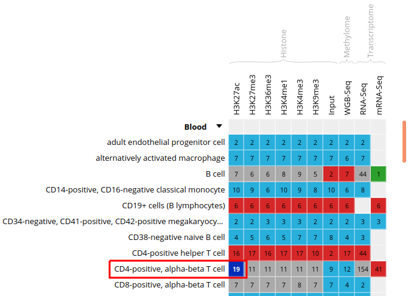

# Module 5: Downstream Analysis and Online Tools
*by David Bujold, M.Sc.*

## Contents: 

1. [Introduction](#introduction)

2. [IHEC Data Portal](#ihec_data_portal)
    
3. [Predicting motifs with HOMER](#homer)

4. [Looking for GO terms enrichment with GREAT](#great)

5. [Going back to HOMER](#back_to_homer)

<a name="introduction"></a>
## Introduction

### Description of the lab
We will now explore some of the tools that were covered in the lecture for module 5.

In this lab, we will:
* Learn how to use an online resource, the IHEC Data Portal, to fetch feature tracks of interest.
* Explore ChIP-Seq peak prediction files (in bed format) to discover motifs using HOMER.
* Use an IHEC dataset with the GREAT GO enrichment tool to perform functions prediction.

### Local software that will be needed

* Tool to connect to your remote terminal session (e.g. Putty in Windows)
* A web browser
* The IGV genome browser

### Prepare directory for module 5

From your command line terminal, go to your workspace folder.

```
cd ~/workspace
```

* If it exists, remove any ```module5``` directory in your home directory with the "rm" command.
* Create a new ```module5``` directory.
* Go to that directory.

```
rm -rf module5
mkdir module5
cd module5
```


<a name="ihec_data_portal"></a>
## IHEC Data Portal

### Exploring available datasets
* Open a web browser on your computer, and load the URL [http://epigenomesportal.ca/ihec](http://epigenomesportal.ca/ihec) .

* In the Overview page, click on the "View all" button, below the pie charts.

* You will get a grid with all available datasets for IHEC Core Assays, on the hg38 assembly.
    * You can filter out visible datasets in the grid using the filtering options at the right of the grid.

* Go back to the Overview page (`Home` on the top menu), and select the following categories of datasets: On the "hg38" reference genome, "Histone" experiments for the "Blood" cell type. Click on `View selected`.


* Only these categories will now get displayed in the grid. Expand the "Blood" category by clicking on the black triangle, and select the following grid cell:


### Visualizing the tracks

* Click on the "Send" button for the UCSC Genome Browser, at the bottom of the grid.


* You can see that the datasets are being displayed on the UCSC Genome Browser. These are all peaks and signal for the chosen blood H3K27ac ChIP-Seq datasets. In the Genome Browser, you can expand the tracks by changing visibility from "pack" to "full" and clicking the "Refresh" button.

    
 
* You can also download these tracks locally for visualization in IGV.
    * Go back to the IHEC Data Portal tab.
    * Click on the "Download tracks" button at the bottom of the grid.
    * Use the download links to download a few of the available tracks.
    * Open them in IGV.

### Tracks correlation
You can get a whole genome overview of the similarity of a group of tracks by using the Portal's correlation tool.

* Back on the Data Grid tab of your browser, from the filters at the right of the grid, add back datasets for all tissues and all assay types. You can select all checkboxes at once by click on the top checkbox, next to "Category". Also remove non-core assays if it is selected.


* Select all ChIP-Seq marks for the cell type "Myeloid cell", under the "Bone Marrow" category. The first 6 columns should be selected.


* At the bottom of the grid, click on the button "Correlate datasets".

* You will see that similar tracks (e.g. those of the same assay, seem to correlate nicely. You can zoom in the view with the mouse scrolling wheel, or with the buttons at the lower right corner of the popup.


* You can also use the correlation tool to assess whether datasets that are supposed to be similar actually are.
    * Close the correlation popup window with the top right "X" button.
    * Reset grid selection with the "Reset" button at the bottom of the grid.
    * Click on the grid cell for cell type "CD4-positive, alpha-beta T cell", under the "Blood" category, and assay "H3K27ac".
    * Click on "Correlate datasets".
    * One dataset seems to be an outlier. This could be, for instance, a problem with the quality of the dataset, or the underlying metadata can indicate that something is different (disease status or some other key element).



You should get something like this:


<a name="homer"></a>
## Predicting motifs with HOMER

We will now attempt to detect motifs in peak regions for transcription factor binding sites using HOMER.

* Reset to the default IHEC Data Portal view by clicking "Data Grid" in the top bar.


* Choose Assembly `hg19`.


* In the filters to the right of the grid, activate non-core IHEC assays, and display only Transcription Factor Binding Sites (```TFBS```) assays.


* In the grid, select ENCODE datasets for the `CTCF` assay and the `B cell` cell type.


* Go to the track list at the bottom of the grid and select only the dataset for sample "ENCBS400ARI".


* You can get the URL to the track you want by clicking on the "Download tracks" button at the bottom of the grid.
Here, we're interested in ```https://epigenomesportal.ca/tracks/ENCODE/hg19/84840.ENCODE.ENCBS400ARI.CTCF.peak_calls.bigBed```. This file contains peaks that were called out of the TFBS ChIP-Seq experiment.
*  _Useful tip_: You can get the full set of metadata about ENCODE experiments and samples by consulting the ENCODE portal, and searching for a given sample name. In this case: `https://www.encodeproject.org/biosamples/ENCBS400ARI/`
* Open your AWS terminal session, create a directory for our HOMER-related files, and go into it. Then, download the BigBed file.

```
mkdir homer
cd homer
wget https://epigenomesportal.ca/tracks/ENCODE/hg19/84840.ENCODE.ENCBS400ARI.CTCF.peak_calls.bigBed
```

* UCSC provides a set of file format conversion tools, such as `bigBedToBed`, which converts a binary bigbed file to its plain text file equivalent. Some of these tools have been pre-installed on your AWS image.
* Convert the bigBed file into a bed file using the UCSC set of tools.

```
bigBedToBed 84840.ENCODE.ENCBS400ARI.CTCF.peak_calls.bigBed 84840.ENCODE.ENCBS400ARI.CTCF.peak_calls.bed
```

* Prepare an output directory for HOMER, and a genome preparsed motifs directory.

```
mkdir output
mkdir preparsed
```

* Run the HOMER software to identify motifs in the peak regions.
  * `-p 4` indicates to use 4 cores.
  * `-S 15` tells Homer to find 15 motifs, instead of the default 25, for execution speed purposes.
  * You can get the full list of parameters here: http://homer.ucsd.edu/homer/ngs/peakMotifs.html

```
findMotifsGenome.pl 84840.ENCODE.ENCBS400ARI.CTCF.peak_calls.bed hg19 output -preparsedDir preparsed -p 4 -S 15
```

* HOMER takes a while to execute for a whole genome track like this. Expect this job to take about 30 minutes of runtime, with your current setup. In the meantime, we will explore the GO terms enrichment tool GREAT.

<a name="great"></a>
## Looking for GO terms enrichment with GREAT

Next, we will try to identify GO terms connected to ChIP-Seq peaks calls using GREAT. We need `bed` files to use the GREAT portal. We will do the conversion from a `bigBed` file to a `bed` file on our AWS session.

* In the IHEC Data Portal, go back to the default grid page (by clicking on Data Grid in the top bar). For assembly `Human (hg38)`, filter the tissues list to keep only "Bone Marrow" tissues. 


* Select the datasets for cell type "Myeloid cell" and assay H3K27ac.


* For this exercise, we will download only one of the bigbeds for available datasets. Pick up the dataset below, for sample `ERS1027405`:


* Click "Download tracks" at the bottom of the grid.

* On the download page, click on `View Full URL List`. This will give you a text list with all tracks of interest. Copy the link to this page in your clipboard, using the address provided in your browser's URL bar.


* Open another terminal session to get into AWS.

* Go to your module5 directory and create a place to put the material we will download.

```
cd ~/workspace/module5
mkdir great
cd great
```

* For you own analyses, you can download a bunch of tracks at the same time by using wget on a list of URLs.
    * Use the **wget** command to download the text file that contains the list of tracks.

```
wget -O trackList.txt 'https://epigenomesportal.ca/api/datahub/download?session=18731&format=text'
```

* Now download the tracks that are contained in this list.
    
```
wget -i trackList.txt
```

* Convert the bigbed using the UCSC set of tools.

```
bigBedToBed 58394.Blueprint.ERS1027405.H3K27ac.peak_calls.bigBed 58394.Blueprint.ERS1027405.H3K27ac.peak_calls.bed
```

**Note:** If you're under Linux / Mac, you can also install the UCSC tools locally, as they are a useful set of tools to manipulate tracks data, without requiring so much processing power.

* GREAT has a limit on the number of regions to be tested in one execution. Therefore, we need to subsample our file. We can create a BED file subsample this way:
    * Sort BED file in random order with ```sort -R```
    * Take the 20000 first lines in the file with ```head -n20000```

```
sort -R 58394.Blueprint.ERS1027405.H3K27ac.peak_calls.bed > 58394.Blueprint.ERS1027405.H3K27ac.peak_calls.random.bed
head -n 20000 58394.Blueprint.ERS1027405.H3K27ac.peak_calls.random.bed > 58394.Blueprint.ERS1027405.H3K27ac.peak_calls.random_short.bed
```

* From your local computer, download the BED file `58394.Blueprint.ERS1027405.H3K27ac.peak_calls.random_short.bed` locally using your browser.

```
http://<your VM ip address>/module5/great/58394.Blueprint.ERS1027405.H3K27ac.peak_calls.random_short.bed
```

* Load the GREAT website: [http://bejerano.stanford.edu/great/public/html/](http://bejerano.stanford.edu/great/public/html/)

* Provide the following input to the GREAT interface:
    * Assembly: **Human: GRCh38**
    * Test regions: The randomized short version of the BED files you just downloaded. (58394.Blueprint.ERS1027405.H3K27ac.peak_calls.random_short.bed)
    * Leave the "Background regions" to its default value, "Whole Genome"

* Submit the form.

* In the results, for instance, you should obtain something like this for biological processes:

    

Bonus question: Why is your result slightly different from the screenshot?

<a name="back_to_homer"></a>
## Going back to HOMER results

* Is the job done? If it is completed, you can bring back HOMER results to your laptop for visualization. First we'll compress the results to a zip file.

```
cd ~/workspace/module5/homer/
zip -r homer.zip output
```

* Next, with your web browser, download the zipped result set.

```
http://<your VM ip address>/module5/homer/homer.zip
```

* Unzip the file, and open the de novo and known motifs HTML files in a browser for visualization. Do the identified motifs fit what we would expect?


## All done!

If you have time remaining, you can explore further the tools that we covered in this lab, using other types of datasets. For example, does running a GREAT query on another cell type yield the type of annotations that you'd expect?

**Interested in exploring Galaxy?** You can start tackling a Galaxy introduction extra lab, available [here](./EPI_2023_module5_galaxy.md). It uses the usegalaxy.org server, so you can also follow it at your own pace after the workshop.
